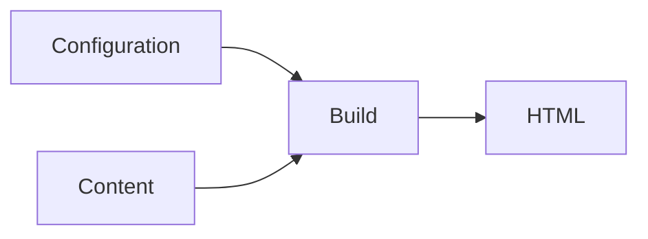

This fictional note demonstrates Markdown. A project can link to [its detail page](/projects/sampling-study/).

```typescript
const message = 'Replace this with your own work';
```


```mermaid
flowchart LR
    Configuration --> Build
    Content --> Build
    Build --> HTML
```
